  
  
  
  

### Hi, I'm Mayank

I build the product, and the automations behind it.

I'm an engineer with nearly 4 years of experience in API integration, workflow orchestration and customer-facing technical delivery: React and Next.js products, secure integrations (OAuth 2.0, JWT, REST, webhooks) and the workflows that connect them. I run self-hosted n8n in Docker and build agentic automations that connect LLMs, APIs and business systems.

- **Co-founder of [Qixazow](https://qixazow.com)**, an AI publication and consultancy focused on n8n, Claude and bringing AI into real businesses.
- **Finishing an M.S. in Information Systems** at Northeastern University, Boston (Dec 2026), focused on AI automation and agentic workflows.
- **Previously Frontend Lead at VeraAI**, where I took an AI interior-design product from a local Next.js codebase to a containerised, hosted deployment.
- **Open to** full-stack and AI automation roles.

### Selected work

| Project | What it does | Built with |
| --- | --- | --- |
| [**Portfolio**](https://github.com/Mayank-1024/Portfolio) | My site: a 3D block-chain hero and self-drawing scenes for each role. [Visit](https://mayankbhadrasen.com) | Next.js · Three.js · GSAP |
| [**Uniswap V2 Interface**](https://github.com/Mayank-1024/UniswapV2) | Swap and liquidity UI with live reserve analytics and x·y=k curve charts. [Live demo](https://mayankuniswapv2-ui.vercel.app/) | TypeScript · ethers / viem · Chart.js |
| [**NexTap**](https://github.com/Mayank-1024/NexTap-NFC-App) | Wallet onboarding and transaction approval with NFC cards and QR login, tested on real devices. | React · TypeScript · Redux |
| [**GameBox**](https://github.com/Mayank-1024/GameBox) | JavaFX suite of memory and reaction games for Alzheimer patients, built on core data structures. | Java · JavaFX |
| [**Emergency Alert**](https://github.com/Mayank-1024/EmergencyAlert_App) | Location-based SOS alerts over SMS and email, triggered by a button or by motion. | Java · Twilio |

### Experience

| Role | Company | When |
| --- | --- | --- |
| Co-founder | [Qixazow](https://qixazow.com) | 2026 - now |
| Frontend Lead (promoted from SDE Intern) | VeraAI Technologies, St. Petersburg FL (remote) | Jul - Dec 2025 |
| Assistant Manager, Front-End Development | AESS Solutions, Bhopal | Nov 2022 - Aug 2024 |
| Associate Software Engineer | Appright Software Solutions, Bangalore | Jul 2021 - Nov 2022 |

### Toolkit

  

  

  
  
  
  

Published: <i>"Safeguarding Digital Assets: Harnessing the Power of Artificial Intelligence for Enhanced Data Protection"</i>, IJISRT Vol. 8 Issue 12, Dec 2023.
